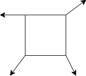
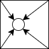
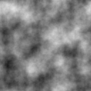
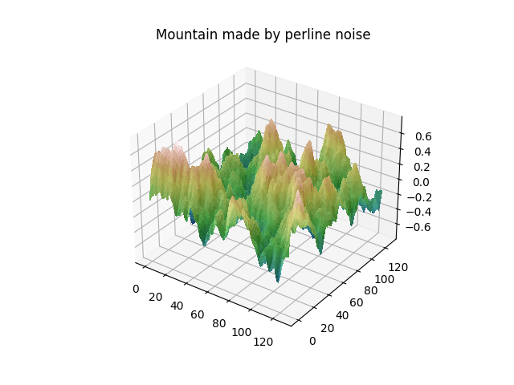
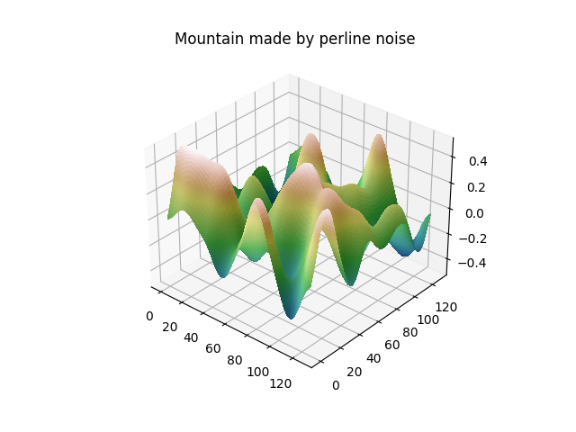
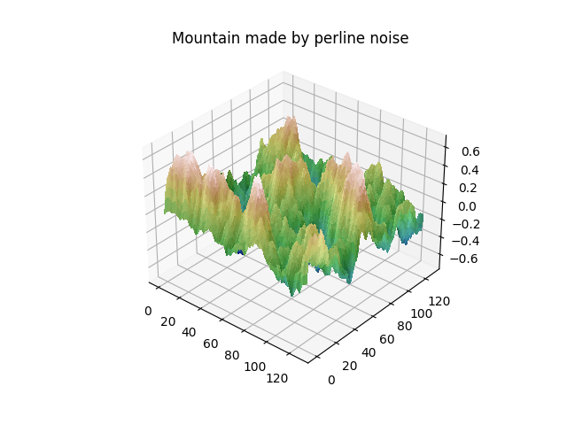

# perline_noise
This repogitory creates various mountains by using [perline noise](https://en.wikipedia.org/wiki/Perlin_noise#:~:text=Perlin%20noise%20is%20a%20type,the%20creation%20of%20image%20textures.). Check out [this article](https://adrianb.io/2014/08/09/perlinnoise.html) to understand perline noise in detail.

<br></br>

## Algorithm
### 1. Create random gradient vectors
Each grid point has a gradient vector, which has a random angle.



```python
dirs = [
    (math.cos(a * 2.0 * math.pi / 256), math.sin(a * 2.0 * math.pi / 256))
    for a in range(256)
]
```

### 2. Caculate distance vector
The vector from each grid point to the target point is called a distance vector.



### 3. Calculate the dot product of the gradient vector and distance vector
A grid point that is close to a certain point has a stronger influence. To do this smoothly, use the following fade function.

$$
6t^5-15t^4+10t^3
$$

```python
def calculate_weighted_dot_product(gridX, gridY, x, y, period, dirs, perm):
    distX, distY = abs(x - gridX), abs(y - gridY)
    # The closer the distance between a point and the grid,
    # the greater the weight of that grid.
    weightX = 1 - 6 * distX**5 + 15 * distX**4 - 10 * distX**3
    weightY = 1 - 6 * distY**5 + 15 * distY**4 - 10 * distY**3
    hashed = perm[perm[int(gridX) % period] + int(gridY) % period]
    dot = (x - gridX) * dirs[hashed][0] + (y - gridY) * dirs[hashed][1]

    return weightX * weightY * dot
```

### 4. Merge results in multiple octaves
By merging results in octaves with different frequencies and amplitudes, you can get more natural and detailed results.

```python
def calculate_octave_perline_noise(x, y, period, octs, dirs, perm):
    noise = 0
    frequency = 2
    # Add noise functions
    for octave in range(octs):
        amplitude = 0.5**octave
        frequency = 2**octave
        noise += amplitude * create_noise(
            x * frequency, y * frequency, period * frequency, dirs, perm
        )

    return noise
```

<br></br>

## Implementation
You can get a 2D random image by running following command.

```bash
python3 create_perline_noise.py --size 128 --octs 5 --set_seed
```



<br></br>

You can get a 3D random mountain by running following command.

```bash
python create_3d_terrain.py --size 128 --octs 5 --set_seed
```



<br></br>

If you want a rough mountain, you should change the number of octs from 5 to 1.



<br></br>

If you want to output a different mountain each time it is executed, do not specify the `--set_seed` argument.

```bash
python create_3d_terrain.py --size 128 --octs 5
```



<br></br>

## References
- [How do you generate tileable Perlin noise?](https://gamedev.stackexchange.com/questions/23625/how-do-you-generate-tileable-perlin-noise)
- [Understanding Perlin Noise](https://adrianb.io/2014/08/09/perlinnoise.html)
- [Improving Noise](https://mrl.cs.nyu.edu/~perlin/paper445.pdf)
- [An Image Synthesizer](https://dl.acm.org/doi/pdf/10.1145/325165.325247)
- [Custom hillshading in a 3D surface plot](https://matplotlib.org/stable/gallery/mplot3d/custom_shaded_3d_surface.html#sphx-glr-gallery-mplot3d-custom-shaded-3d-surface-py)
